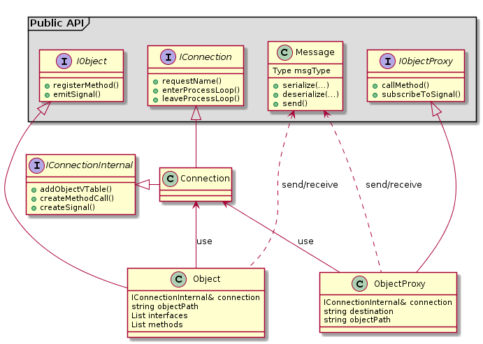

Using sdbus-c++ library
=======================

**Table of contents**

1. [Introduction](#introduction)
2. [Integrating sdbus-c++ into your project](#integrating-sdbus-c-into-your-project)
3. [Header files and namespaces](#header-files-and-namespaces)
4. [Error signalling and propagation](#error-signalling-and-propagation)
5. [Multiple layers of sdbus-c++ API](#multiple-layers-of-sdbus-c-api)
6. [An example: Number concatenator](#an-example-number-concatenator)
7. [Implementing the Concatenator example using basic sdbus-c++ API layer](#implementing-the-concatenator-example-using-basic-sdbus-c-api-layer)
8. [Implementing the Concatenator example using convenience sdbus-c++ API layer](#implementing-the-concatenator-example-using-convenience-sdbus-c-api-layer)
9. [Implementing the Concatenator example using sdbus-c++-generated stubs](#implementing-the-concatenator-example-using-sdbus-c-generated-stubs)
10. [Asynchronous server-side methods](#asynchronous-server-side-methods)
11. [Asynchronous client-side methods](#asynchronous-client-side-methods)
12. [Using D-Bus properties](#using-d-bus-properties)
13. [Conclusion](#conclusion)

Introduction
------------

sdbus-c++ is a C++ wrapper library built on top of [sd-bus](http://0pointer.net/blog/the-new-sd-bus-api-of-systemd.html), a lightweight D-Bus client
library implemented within systemd project. It provides D-Bus functionality on a higher level of abstraction, trying to employ C++ type system 
to shift as much work as possible from the developer to the compiler.

sdbus-c++ does not cover the entire sd-bus API, but provides tools for implementing the most common functionality - RPC 
method calls, signals and properties. There is room for additions and improvements, as needed and when needed.

Integrating sdbus-c++ into your project
---------------------------------------

The library build system is based on CMake. The library provides a config file, so integrating it into your CMake project is rather straight-forward:

```bash
find_package(sdbus-c++ REQUIRED)
```

The library also supports `pkg-config`, so it easily be integrated into e.g. an Autotools project:

```bash
PKG_CHECK_MODULES(SDBUSCPP, [sdbus-c++ >= 0.4],,
    AC_MSG_ERROR([You need the sdbus-c++ library (version 0.4 or newer)]
    [http://www.kistler.com/])
)
```

Note: sdbus-c++ library depends on C++17, since it uses C++17 `std::uncaught_exceptions()` feature. When building sdbus-c++ manually, make sure you use a compiler that supports that feature. To use the library, make sure you have a C++ standard library that supports the feature. The feature is supported by e.g. gcc >= 6, and clang >= 3.7.

Header files and namespaces
---------------------------

All sdbus-c++ header files reside in the `sdbus-c++` subdirectory within the standard include directory. Users can either include 
individual header files, like so:

```cpp
#include <sdbus-c++/IConnection.h>
#include <sdbus-c++/IObjectProxy.h>
```

or just include the global header file that pulls in everything:

```cpp
#include <sdbus-c++/sdbus-c++.h>
```

All public types and functions of sdbus-c++ reside in the `sdbus` namespace.

Error signalling and propagation
--------------------------------

`sdbus::Error` exception is used to signal errors in sdbus-c++. There are two types of errors:
  * D-Bus related errors, like call timeouts, failed socket allocation, etc.
  * user errors, i.e. errors signalled and propagated from remote methods back to the caller.

The exception object carries the error name and error message with it.

sdbus-c++ design
----------------

The following diagram illustrates the major entities in sdbus-c++.



`IConnection` represents the concept of a D-Bus connection. You can connect to either the system bus or a session bus. Services can assign unique service names to those connections. A processing loop can be run on the connection.

`IObject` represents the concept of an object that exposes its methods, signals and properties. Its responsibilities are:
* registering (possibly multiple) interfaces and methods, signals, properties on those interfaces,
* emitting signals.
    
`IObjectProxy` represents the concept of the proxy, which is a view of the `Object` from the client side. Its responsibilities are:
* invoking remote methods of the corresponding object,
* registering handlers for signals.

`Message` class represents a message, which is the fundamental DBus concept. There are three distinctive types of message that derive from the `Message` class:
* `MethodCall` (with serialized parameters),
* `MethodReply` (with serialized return values),
* or a `Signal` (with serialized parameters).

Multiple layers of sdbus-c++ API
-------------------------------

sdbus-c++ API comes in two layers:
  * [the basic layer](#implementing-the-concatenator-example-using-basic-sdbus-c-api-layer), which is a simple wrapper layer on top of sd-bus, using mechanisms that are native to C++ (e.g. serialization/deserialization of data from messages),
  * [the convenience layer](#implementing-the-concatenator-example-using-convenience-sdbus-c-api-layer), building on top of the basic layer, which aims at alleviating users from unnecessary details and enables them to write shorter, safer, and more expressive code.

sdbus-c++ also ships with a stub generator tool that converts D-Bus IDL in XML format into stub code for the adaptor as well as proxy part. Hierarchically, these stubs provide yet another layer of convenience (the "stubs layer"), making it possible for D-Bus RPC calls to completely look like native C++ calls on a local object.

An example: Number concatenator
-------------------------------

Let's have an object `/org/sdbuscpp/concatenator` that implements the `org.sdbuscpp.concatenator` interface. The interface exposes the following:
* a `concatenate` method that takes a collection of integers and a separator string and returns a string that is the concatenation of all 
  integers from the collection using given separator,
* a `concatenated` signal that is emitted at the end of each successful concatenation.

In the following sections, we will elaborate on the ways of implementing such an object on both the server and the client side.

Implementing the Concatenator example using basic sdbus-c++ API layer
---------------------------------------------------------------------

In the basic API layer, we already have abstractions for D-Bus connections, objects and object proxies, with which we can interact via 
interfaces. However, we still work with the concept of messages. To issue a method call for example, we have to go through several steps: 
we have to create a method call message first, serialize method arguments into the message, and send the message at last. We get the reply 
message (if applicable) in return, so we have to deserialize the return values from it manually.

Overloaded versions of C++ insertion/extraction operators are used for serialization/deserialization. That makes the client code much simpler.

### Server side

```c++
#include <sdbus-c++/sdbus-c++.h>
#include <vector>
#include <string>

// Yeah, global variable is ugly, but this is just an example and we want to access 
// the concatenator instance from within the concatenate method handler to be able
// to emit signals.
sdbus::IObject* g_concatenator{};

void concatenate(sdbus::MethodCall& call, sdbus::MethodReply& reply)
{
    // Deserialize the collection of numbers from the message
    std::vector<int> numbers;
    call >> numbers;
    
    // Deserialize separator from the message
    std::string separator;
    call >> separator;
    
    // Return error if there are no numbers in the collection
    if (numbers.empty())
        throw sdbus::Error("org.sdbuscpp.Concatenator.Error", "No numbers provided");
    
    std::string result;
    for (auto number : numbers)
    {
        result += (result.empty() ? std::string() : separator) + std::to_string(number);
    }
    
    // Serialize resulting string to the reply
    reply << result;
    
    // Emit 'concatenated' signal
    const char* interfaceName = "org.sdbuscpp.Concatenator";
    auto signal = g_concatenator->createSignal(interfaceName, "concatenated");
    signal << result;
    g_concatenator->emitSignal(signal);
}

int main(int argc, char *argv[])
{
    // Create D-Bus connection to the system bus and requests name on it.
    const char* serviceName = "org.sdbuscpp.concatenator";
    auto connection = sdbus::createSystemBusConnection(serviceName);

    // Create concatenator D-Bus object.
    const char* objectPath = "/org/sdbuscpp/concatenator";
    auto concatenator = sdbus::createObject(*connection, objectPath);
    
    g_concatenator = concatenator.get();
    
    // Register D-Bus methods and signals on the concatenator object, and exports the object.
    const char* interfaceName = "org.sdbuscpp.Concatenator";
    concatenator->registerMethod(interfaceName, "concatenate", "ais", "s", &concatenate);
    concatenator->registerSignal(interfaceName, "concatenated", "s");
    concatenator->finishRegistration();

    // Run the loop on the connection.
    connection->enterProcessingLoop();
}
```

### Client side

```c++
#include <sdbus-c++/sdbus-c++.h>
#include <vector>
#include <string>
#include <iostream>
#include <unistd.h>

void onConcatenated(sdbus::Signal& signal)
{
    std::string concatenatedString;
    signal >> concatenatedString;
    
    std::cout << "Received signal with concatenated string " << concatenatedString << std::endl;
}

int main(int argc, char *argv[])
{
    // Create proxy object for the concatenator object on the server side. Since here
    // we are creating the proxy instance without passing connection to it, the proxy
    // will create its own connection automatically, and it will be system bus connection.
    const char* destinationName = "org.sdbuscpp.concatenator";
    const char* objectPath = "/org/sdbuscpp/concatenator";
    auto concatenatorProxy = sdbus::createObjectProxy(destinationName, objectPath);
    
    // Let's subscribe for the 'concatenated' signals
    const char* interfaceName = "org.sdbuscpp.Concatenator";
    concatenatorProxy->registerSignalHandler(interfaceName, "concatenated", &onConcatenated);
    concatenatorProxy->finishRegistration();
    
    std::vector<int> numbers = {1, 2, 3};
    std::string separator = ":";
    
    // Invoke concatenate on given interface of the object
    {
        auto method = concatenatorProxy->createMethodCall(interfaceName, "concatenate");
        method << numbers << separator;
        auto reply = concatenatorProxy->callMethod(method);
        std::string result;
        reply >> result;
        assert(result == "1:2:3");
    }
    
    // Invoke concatenate again, this time with no numbers and we shall get an error
    {
        auto method = concatenatorProxy->createMethodCall(interfaceName, "concatenate");
        method << std::vector<int>() << separator;
        try
        {
            auto reply = concatenatorProxy->callMethod(method);
            assert(false);
        }
        catch(const sdbus::Error& e)
        {
            std::cerr << "Got concatenate error " << e.getName() << " with message " << e.getMessage() << std::endl;
        }
    }
    
    // Give sufficient time to receive 'concatenated' signal from the first concatenate invocation
    sleep(1);
    
    return 0;
}
```

### Proxy and D-Bus connection

There are three ways of creating the object proxy -- three overloads of `sdbus::createObjectProxy`. They differ from each other as to how the proxy towards the connection will behave upon creation:

* One that takes no connection as a parameter. This one is for convenience -- if you have a simple application and don't want to bother with connections, call this one. Internally, it will create a connection object, and it will be a *system* bus connection. The proxy will immediately create an internal thread and start a processing loop upon the clone of this connection in this thread as long as there is at least one signal registered, so the signals are correctly received and the callbacks are handled from within this internal thread. If there is no signal, i.e. the proxy just provides methods and/or properties, no connection clone is made, no thread is created and no processing loop is started -- you don't pay for what you don't use.

* One that takes the connection as an **rvalue unique_ptr**. This one behaves the same as the above one, just that you must create the connection by yourself, and then `std::move` the ownership of it to the proxy. This comes with a flexibility that you can choose connection type (system, session).

* One that takes the connection as an **lvalue reference**. This one behaves differently. You as a client are the owner of the connection, you take full control of it. The proxy just references the connection. This means the proxy does no async processing on it even when there are signals. It relies on you to manage the processing loop yourself (if you need it for signals).

Implementing the Concatenator example using convenience sdbus-c++ API layer
---------------------------------------------------------------------------

One of the major sdbus-c++ design goals is to make the sdbus-c++ API easy to use correctly, and hard to use incorrectly.

The convenience API layer abstracts the concept of underlying D-Bus messages away completely. It abstracts away D-Bus signatures. And it tries 
to provide an interface that uses small, focused functions, with one or zero parameters, to form a chained function statement that reads like
a sentence to a human reading the code. To achieve that, sdbus-c++ utilizes the power of the C++ type system, so many issues are resolved at 
compile time, and the run-time performance cost compared to the basic layer is close to zero.

Thus, in the end of the day, the code written using the convenience API is:
- more expressive,
- closer to the abstraction level of the problem being solved,
- shorter,
- almost as fast (if not equally fast) as one written using the basic API layer.

Rather than *how*, the code written using this layer expresses *what* it does. Let's look at code samples to see if you agree :)

### Server side

```c++
#include <sdbus-c++/sdbus-c++.h>
#include <vector>
#include <string>

// Yeah, global variable is ugly, but this is just an example and we want to access 
// the concatenator instance from within the concatenate method handler to be able
// to emit signals.
sdbus::IObject* g_concatenator{};

std::string concatenate(const std::vector<int> numbers, const std::string& separator)
{
    // Return error if there are no numbers in the collection
    if (numbers.empty())
        throw sdbus::Error("org.sdbuscpp.Concatenator.Error", "No numbers provided");
    
    std::string result;
    for (auto number : numbers)
    {
        result += (result.empty() ? std::string() : separator) + std::to_string(number);
    }
    
    // Emit 'concatenated' signal
    const char* interfaceName = "org.sdbuscpp.Concatenator";
    g_concatenator->emitSignal("concatenated").onInterface(interfaceName).withArguments(result);
    
    return result;
}

int main(int argc, char *argv[])
{
    // Create D-Bus connection to the system bus and requests name on it.
    const char* serviceName = "org.sdbuscpp.concatenator";
    auto connection = sdbus::createSystemBusConnection(serviceName);

    // Create concatenator D-Bus object.
    const char* objectPath = "/org/sdbuscpp/concatenator";
    auto concatenator = sdbus::createObject(*connection, objectPath);
    
    g_concatenator = concatenator.get();
    
    // Register D-Bus methods and signals on the concatenator object, and exports the object.
    const char* interfaceName = "org.sdbuscpp.Concatenator";
    concatenator->registerMethod("concatenate").onInterface(interfaceName).implementedAs(&concatenate);
    concatenator->registerSignal("concatenated").onInterface(interfaceName).withParameters<std::string>();
    concatenator->finishRegistration();

    // Run the loop on the connection.
    connection->enterProcessingLoop();
}
```

### Client side

```c++
#include <sdbus-c++/sdbus-c++.h>
#include <vector>
#include <string>
#include <iostream>
#include <unistd.h>

void onConcatenated(const std::string& concatenatedString)
{
    std::cout << "Received signal with concatenated string " << concatenatedString << std::endl;
}

int main(int argc, char *argv[])
{
    // Create proxy object for the concatenator object on the server side
    const char* destinationName = "org.sdbuscpp.concatenator";
    const char* objectPath = "/org/sdbuscpp/concatenator";
    auto concatenatorProxy = sdbus::createObjectProxy(destinationName, objectPath);
    
    // Let's subscribe for the 'concatenated' signals
    const char* interfaceName = "org.sdbuscpp.Concatenator";
    concatenatorProxy->uponSignal("concatenated").onInterface(interfaceName).call([](const std::string& str){ onConcatenated(str); });
    concatenatorProxy->finishRegistration();
    
    std::vector<int> numbers = {1, 2, 3};
    std::string separator = ":";
    
    // Invoke concatenate on given interface of the object
    {
        std::string concatenatedString;
        concatenatorProxy->callMethod("concatenate").onInterface(interfaceName).withArguments(numbers, separator).storeResultsTo(concatenatedString);
        assert(concatenatedString == "1:2:3");
    }
    
    // Invoke concatenate again, this time with no numbers and we shall get an error
    {
        try
        {
            concatenatorProxy->callMethod("concatenate").onInterface(interfaceName).withArguments(std::vector<int>(), separator);
            assert(false);
        }
        catch(const sdbus::Error& e)
        {
            std::cerr << "Got concatenate error " << e.getName() << " with message " << e.getMessage() << std::endl;
        }
    }
    
    // Give sufficient time to receive 'concatenated' signal from the first concatenate invocation
    sleep(1);
    
    return 0;
}
```

Several lines of code have shrunk into one-liners when registering/calling methods or signals. D-Bus signatures and the serialization/deserialization 
of arguments from the messages is generated at compile time, by introspecting signatures of provided callbacks or deducing types of provided arguments.

Implementing the Concatenator example using sdbus-c++-generated stubs
---------------------------------------------------------------------

sdbus-c++ ships with the native stub generator tool called sdbuscpp-xml2cpp. The tool is very similar to dbusxx-xml2cpp tool that comes from 
dbus-c++ project.

The generator tool takes D-Bus XML IDL description of D-Bus interfaces on its input, and can be instructed to generate one or both of these: 
an adaptor header file for use at server side, and a proxy header file for use at client side. Like this:

```bash
sdbuscpp-xml2cpp database-bindings.xml --adaptor=database-server-glue.h --proxy=database-client-glue.h
```

The adaptor header file contains classes that can be used to implement described interfaces. The proxy header file contains classes that can be used 
to make calls to remote objects.

### XML description of the Concatenator interface

As an example, let's look at an XML description of our Concatenator's interfaces.

```xml
<?xml version="1.0" encoding="UTF-8"?>

<node name="/org/sdbuscpp/concatenator">
    <interface name="org.sdbuscpp.Concatenator">
        <method name="concatenate">
            <arg type="ai" name="numbers" direction="in" />
            <arg type="s" name="separator" direction="in" />
            <arg type="s" name="concatenatedString" direction="out" />
        </method>
        <signal name="concatenated">
            <arg type="s" name="concatenatedString" />
        </signal>
    </interface>
</node>
```

After running this through the stubs generator, we get the stub code that is described in the following two subsections.

### concatenator-server-glue.h

There is specific class for each interface in the XML IDL file. The class is de facto an interface which shall be implemented by inheriting from it. 
The class' constructor takes care of registering all methods, signals and properties. For each D-Bus method there is a pure virtual member function.
These pure virtual functions must be implemented in the child class. For each signal, there is a public function member that emits this signal.

```cpp
/*
 * This file was automatically generated by sdbuscpp-xml2cpp; DO NOT EDIT!
 */

#ifndef __sdbuscpp__concatenator_server_glue_h__adaptor__H__
#define __sdbuscpp__concatenator_server_glue_h__adaptor__H__

#include <sdbus-c++/sdbus-c++.h>
#include <string>
#include <tuple>

namespace org {
namespace sdbuscpp {

class Concatenator_adaptor
{
public:
    static constexpr const char* interfaceName = "org.sdbuscpp.Concatenator";

protected:
    Concatenator_adaptor(sdbus::IObject& object)
        : object_(object)
    {
        object_.registerMethod("concatenate").onInterface(interfaceName).implementedAs([this](const std::vector<int32_t>& numbers, const std::string& separator){ return this->concatenate(numbers, separator); });
        object_.registerSignal("concatenated").onInterface(interfaceName).withParameters<std::string>();
    }

public:
    void concatenated(const std::string& concatenatedString)
    {
        object_.emitSignal("concatenated").onInterface(interfaceName).withArguments(concatenatedString);
    }

private:
    virtual std::string concatenate(const std::vector<int32_t>& numbers, const std::string& separator) = 0;

private:
    sdbus::IObject& object_;
};

}} // namespaces

#endif
```

### concatenator-client-glue.h

Analogously to the adaptor classes described above, there is specific class for each interface in the XML IDL file. The class is de facto a proxy 
to the concrete interface of a remote object. For each D-Bus signal there is a pure virtual member function whose body must be provided in a child
class. For each method, there is a public function member that calls the method remotely.

```cpp
/*
 * This file was automatically generated by sdbuscpp-xml2cpp; DO NOT EDIT!
 */

#ifndef __sdbuscpp__concatenator_client_glue_h__proxy__H__
#define __sdbuscpp__concatenator_client_glue_h__proxy__H__

#include <sdbus-c++/sdbus-c++.h>
#include <string>
#include <tuple>

namespace org {
namespace sdbuscpp {

class Concatenator_proxy
{
public:
    static constexpr const char* interfaceName = "org.sdbuscpp.Concatenator";

protected:
    Concatenator_proxy(sdbus::IObjectProxy& object)
        : object_(object)
    {
        object_.uponSignal("concatenated").onInterface(interfaceName).call([this](const std::string& concatenatedString){ this->onConcatenated(concatenatedString); });
    }

    virtual void onConcatenated(const std::string& concatenatedString) = 0;

public:
    std::string concatenate(const std::vector<int32_t>& numbers, const std::string& separator)
    {
        std::string result;
        object_.callMethod("concatenate").onInterface(interfaceName).withArguments(numbers, separator).storeResultsTo(result);
        return result;
    }

private:
    sdbus::IObjectProxy& object_;
};

}} // namespaces

#endif
```

### Providing server implementation based on generated adaptors

To implement a D-Bus object that implements all its D-Bus interfaces, we shall create a class representing the object that inherits from all 
corresponding `*_adaptor` classes and implements all pure virtual member functions. Specifically, the object class shall inherit from the 
`Interfaces` template class, the template arguments of which are individual adaptor classes. The `Interfaces` is just a convenience class that 
hides a few boiler-plate details. For example, in its constructor, it creates an `Object` instance, it takes care of proper initialization of 
all adaptor superclasses, and exports the object finally.

```cpp
#include <sdbus-c++/sdbus-c++.h>
#include "concatenator-server-glue.h"

class Concatenator : public sdbus::Interfaces<org::sdbuscpp::Concatenator_adaptor /*, more adaptor classes if there are more interfaces*/>
{
public:
    Concatenator(sdbus::IConnection& connection, std::string objectPath)
        : sdbus::Interfaces<org::sdbuscpp::Concatenator_adaptor>(connection, std::move(objectPath))
    {
    }

protected:
    std::string concatenate(const std::vector<int32_t>& numbers, const std::string& separator) override
    {
        // Return error if there are no numbers in the collection
        if (numbers.empty())
            throw sdbus::Error("org.sdbuscpp.Concatenator.Error", "No numbers provided");
        
        // Concatenate the numbers
        std::string result;
        for (auto number : numbers)
        {
            result += (result.empty() ? std::string() : separator) + std::to_string(number);
        }
        
        // Emit the 'concatenated' signal with the resulting string
        concatenated(result);
        
        // Return the resulting string
        return result;
    }
};
```

That's it. We now have an implementation of a D-Bus object implementing `org.sdbuscpp.Concatenator` interface. Let's now create a service 
publishing the object.

```cpp
#include "Concatenator.h"

int main(int argc, char *argv[])
{
    // Create D-Bus connection to the system bus and requests name on it.
    const char* serviceName = "org.sdbuscpp.concatenator";
    auto connection = sdbus::createSystemBusConnection(serviceName);

    // Create concatenator D-Bus object.
    const char* objectPath = "/org/sdbuscpp/concatenator";
    Concatenator concatenator(*connection, objectPath);

    // Run the loop on the connection.
    connection->enterProcessingLoop();
}
```

It's that simple!

### Providing client implementation based on generated proxies

To implement a proxy for a remote D-Bus object, we shall create a class representing the object proxy that inherits from all corresponding 
`*_proxy` classes and -- if applicable -- implements all pure virtual member functions. Specifically, the object proxy class shall inherit 
from the `ProxyInterfaces` template class. As its template arguments we shall provide all proxy classes. The `ProxyInterfaces` is just a 
convenience class that hides a few boiler-plate details. For example, in its constructor, it creates an `ObjectProxy` instance, and it takes 
care of proper initialization of all proxy superclasses.

```cpp
#include <sdbus-c++/sdbus-c++.h>
#include "concatenator-client-glue.h"

class ConcatenatorProxy : public sdbus::ProxyInterfaces<org::sdbuscpp::Concatenator_proxy /*, more proxy classes if there are more interfaces*/>
{
public:
    ConcatenatorProxy(std::string destination, std::string objectPath)
        : sdbus::ProxyInterfaces<org::sdbuscpp::Concatenator_proxy>(std::move(destination), std::move(objectPath))
    {
    }

protected:
    void onConcatenated(const std::string& concatenatedString) override
    {
        std::cout << "Received signal with concatenated string " << concatenatedString << std::endl;
    }
};
```

In the above example, a proxy is created that creates and maintains its own system bus connection. However, there are `ProxyInterfaces` class template constructor overloads that also take the connection from the user as the first parameter, and pass that connection over to the underlying proxy. The connection instance is used for all D-Bus proxy interfaces listed in the `ProxyInterfaces` template parameter list.

Note however that there are multiple `ProxyInterfaces` constructor overloads, and they differ in how the proxy behaves towards the D-Bus connection. These overloads precisely map the `sdbus::createObjectProxy` overloads, as they are actually implemented on top of them. See [Proxy and D-Bus connection](#Proxy-and-D-Bus-connection) for more info.

Now let's use this proxy to make remote calls and listen to signals in a real application.

```cpp
#include "ConcatenatorProxy.h"
#include <unistd.h>

int main(int argc, char *argv[])
{
    // Create proxy object for the concatenator object on the server side
    const char* destinationName = "org.sdbuscpp.concatenator";
    const char* objectPath = "/org/sdbuscpp/concatenator";
    ConcatenatorProxy concatenatorProxy(destinationName, objectPath);

    std::vector<int> numbers = {1, 2, 3};
    std::string separator = ":";
    
    // Invoke concatenate with some numbers
    auto concatenatedString = concatenatorProxy.concatenate(numbers, separator);
    assert(concatenatedString == "1:2:3");
    
    // Invoke concatenate again, this time with no numbers and we shall get an error
    try
    {
        auto concatenatedString = concatenatorProxy.concatenate(std::vector<int>(), separator);
        assert(false);
    }
    catch(const sdbus::Error& e)
    {
        std::cerr << "Got concatenate error " << e.getName() << " with message " << e.getMessage() << std::endl;
    }
    
    // Give sufficient time to receive 'concatenated' signal from the first concatenate invocation
    sleep(1);
    
    return 0;
}
```

Asynchronous server-side methods
--------------------------------

So far in our tutorial, we have only considered simple server methods that are executed in a synchronous way. Sometimes the method call may take longer, however, and we don't want to block (potentially starve) other clients (whose requests may take relative short time). The solution is to execute the D-Bus methods asynchronously, and return the control quickly back to the D-Bus dispatching thread. sdbus-c++ provides API supporting async methods, and gives users the freedom to come up with their own concrete implementation mechanics (one worker thread? thread pool? ...).

### Lower-level API

Considering the Concatenator example based on lower-level API, if we wanted to write `concatenate` method in an asynchronous way, you only have to adapt method signature and its body (registering the method and all the other stuff stays the same):

```c++
void concatenate(sdbus::MethodCall& call, sdbus::MethodResult result)
{
    // Deserialize the collection of numbers from the message
    std::vector<int> numbers;
    call >> numbers;
    
    // Deserialize separator from the message
    std::string separator;
    call >> separator;
    
    // Launch a thread for async execution...
    std::thread([numbers, separator, result = std::move(result)]()
    {
        // Return error if there are no numbers in the collection
        if (numbers.empty())
        {
            // This will send the error reply message back to the client
            result.returnError("org.sdbuscpp.Concatenator.Error", "No numbers provided");
            return;
        }
        
        std::string concatenatedStr;
        for (auto number : numbers)
        {
            concatenatedStr += (result.empty() ? std::string() : separator) + std::to_string(number);
        }
        
        // This will send the reply message back to the client
        result.returnResults(concatenatedStr);
        
        // Note: emitting signals from other than D-Bus dispatcher thread is not supported yet...
        /*
        // Emit 'concatenated' signal
        const char* interfaceName = "org.sdbuscpp.Concatenator";
        auto signal = g_concatenator->createSignal(interfaceName, "concatenated");
        signal << result;
        g_concatenator->emitSignal(signal);
        */
    }).detach();
}
```

Notice these differences as compared to the synchronous version:

* Instead of `MethodReply` message given by reference, there is `MethodResult` as a second parameter of the callback, which will hold method results and can be written to from any thread.
* You shall pass the result holder (`MethodResult` instance) by moving it to the thread of execution, and eventually write method results (or method error) to it via its `returnResults()` or `returnError()` method, respectively.
* Unlike in sync methods, reporting errors cannot be done by throwing sdbus::Error, since the execution takes place out of context of the D-Bus dispatcher thread. Instead, just pass the error name and message to the `returnError` method of the result holder.

That's all.

### Convenience API

Method callbacks in convenience sdbus-c++ API also need to take the result object as a parameter. The requirements are:

* The result holder is of type `sdbus::Result<Types...>`, where `Types...` is a list of method output argument types.
* The result object must be a first physical parameter of the callback taken by value.
* The callback itself is physically a void-returning function.

For example, we would have to change the concatenate callback signature from `std::string concatenate(const std::vector<int32_t>& numbers, const std::string& separator)` to `void concatenate(sdbus::Result<std::string> result, const std::vector<int32_t>& numbers, const std::string& separator)`.

`sdbus::Result` class template has effectively the same API as `sdbus::MethodResult` class mentioned in the above example (it inherits from `MethodResult`), so you use it in the very same way to send the results or an error back to the client.

Nothing else has to be changed. The registration of the method callback (`implementedAs`) and all the mechanics around remains completely the same.

Note: Async D-Bus method doesn't necessarily mean we always have to delegate the work to a different thread and immediately return. We can very well execute the work and return the results (via `returnResults()`) or an error (via `return Error()`) synchronously -- i.e. directly in this thread. dbus-c++ doesn't care, it supports both approaches. This has the benefit that we can decide at run-time, per each method call, whether we execute it synchronously or (in case of complex operation, for example) execute it asynchronously by moving the work to a worker thread.

### Marking server-side async methods in the IDL

sdbus-c++ stub generator can generate stub code for server-side async methods. We just need to annotate the method with the `annotate` element having the "org.freedesktop.DBus.Method.Async" name. The element value must be either "server" (async method on server-side only) or "clientserver" (async method on both client- and server-side):

```xml
<?xml version="1.0" encoding="UTF-8"?>

<node name="/org/sdbuscpp/concatenator">
    <interface name="org.sdbuscpp.Concatenator">
        <method name="concatenate">
            <annotation name="org.freedesktop.DBus.Method.Async" value="server" />
            <arg type="ai" name="numbers" direction="in" />
            <arg type="s" name="separator" direction="in" />
            <arg type="s" name="concatenatedString" direction="out" />
        </method>
        <signal name="concatenated">
            <arg type="s" name="concatenatedString" />
        </signal>
    </interface>
</node>
```

Asynchronous client-side methods
--------------------------------

sdbus-c++ also supports asynchronous approach at the client (the proxy) side. With this approach, we can issue a D-Bus method call without blocking current thread's execution while waiting for the reply. We go on doing other things, and when the reply comes, a given callback is invoked within the context of the D-Bus dispatcher thread.

### Lower-level API

Considering the Concatenator example based on lower-level API, if we wanted to call `concatenate` in an async way, we'd have to pass a callback to the proxy when issuing the call, and that callback gets invoked when the reply arrives:

```c++
int main(int argc, char *argv[])
{
    /* ...  */
    
    auto callback = [](MethodReply& reply, const sdbus::Error* error)
    {
        if (error == nullptr) // No error
        {
            std::string result;
            reply >> result;
            std::cout << "Got concatenate result: " << result << std::endl;
        }
        else // We got a D-Bus error...
        {
            std::cerr << "Got concatenate error " << error->getName() << " with message " << error->getMessage() << std::endl;
        }
    }

    // Invoke concatenate on given interface of the object
    {
        auto method = concatenatorProxy->createMethodCall(interfaceName, "concatenate");
        method << numbers << separator;
        concatenatorProxy->callMethod(method, callback);
        // When the reply comes, we shall get "Got concatenate result 1:2:3" on the standard output
    }
    
    // Invoke concatenate again, this time with no numbers and we shall get an error
    {
        auto method = concatenatorProxy->createMethodCall(interfaceName, "concatenate");
        method << std::vector<int>() << separator;
        concatenatorProxy->callMethod(method, callback);
        // When the reply comes, we shall get concatenation error message on the standard error output
    }

    /* ... */

    return 0;
}
```

The callback is a void-returning function taking two arguments: a reference to the reply message, and a pointer to the prospective `sdbus::Error` instance. Zero `Error` pointer means that no D-Bus error occurred while making the call, and the reply message contains valid reply. Non-zero `Error` pointer, however, points to the valid `Error` instance, meaning that an error occurred. Error name and message can then be read out by the client from that instance.

### Convenience API

On the convenience API level, the call statement starts with `callMethodAsync()`, and ends with `uponReplyInvoke()` that takes a callback handler. The callback is a void-returning function that takes at least one argument: pointer to the `sdbus::Error` instance. All subsequent arguments shall exactly reflect the D-Bus method output arguments. A concatenator example:

```c++
int main(int argc, char *argv[])
{
    /* ...  */
    
    auto callback = [](const sdbus::Error* error, const std::string& concatenatedString)
    {
        if (error == nullptr) // No error
            std::cout << "Got concatenate result: " << concatenatedString << std::endl;
        else // We got a D-Bus error...
            std::cerr << "Got concatenate error " << error->getName() << " with message " << error->getMessage() << std::endl;
    }

    // Invoke concatenate on given interface of the object
    {
        concatenatorProxy->callMethodAsync("concatenate").onInterface(interfaceName).withArguments(numbers, separator).uponReplyInvoke(callback);
        // When the reply comes, we shall get "Got concatenate result 1:2:3" on the standard output
    }

    // Invoke concatenate again, this time with no numbers and we shall get an error
    {
        concatenatorProxy->callMethodAsync("concatenate").onInterface(interfaceName).withArguments(std::vector<int>{}, separator).uponReplyInvoke(callback);
        // When the reply comes, we shall get concatenation error message on the standard error output
    }

    /* ... */

    return 0;
}
```

When the `Error` pointer is zero, it means that no D-Bus error occurred while making the call, and subsequent arguments are valid D-Bus method return values. Non-zero `Error` pointer, however, points to the valid `Error` instance, meaning that an error occurred during the call (and subsequent arguments are simply default-constructed). Error name and message can then be read out by the client from `Error` instance. 

### Marking client-side async methods in the IDL

sdbus-c++ stub generator can generate stub code for client-side async methods. We just need to annotate the method with the `annotate` element having the "org.freedesktop.DBus.Method.Async" name. The element value must be either "client" (async on the client-side only) or "clientserver" (async method on both client- and server-side):

```xml
<?xml version="1.0" encoding="UTF-8"?>

<node name="/org/sdbuscpp/concatenator">
    <interface name="org.sdbuscpp.Concatenator">
        <method name="concatenate">
            <annotation name="org.freedesktop.DBus.Method.Async" value="client" />
            <arg type="ai" name="numbers" direction="in" />
            <arg type="s" name="separator" direction="in" />
            <arg type="s" name="concatenatedString" direction="out" />
        </method>
        <signal name="concatenated">
            <arg type="s" name="concatenatedString" />
        </signal>
    </interface>
</node>
```

For each client-side async method, a corresponding `on<MethodName>Reply` pure virtual function, where <MethodName> is capitalized D-Bus method name, is generated in the generated proxy class. This function is the callback invoked when the D-Bus method reply arrives, and must be provided a body by overriding it in the implementation class.
    
So in the specific example above, the stub generator will generate a `Concatenator_proxy` class similar to one shown in a [dedicated section above](#concatenator-client-glueh), with the difference that it will also generate an additional `virtual void onConcatenateReply(const sdbus::Error* error, const std::string& concatenatedString);` method, which we shall override in derived `ConcatenatorProxy`.

Using D-Bus properties
----------------------

Defining and working with D-Bus properties using XML description is quite easy.

### Defining a property in the XML

A property element has no arg child element. It just has the attributes name, type and access, which are all mandatory. The access attribute allows the values ‘readwrite’, ‘read’, and ‘write’.

An example of a read-write property `status`:

```xml
<?xml version="1.0" encoding="UTF-8"?>

<node name="/org/sdbuscpp/propertyprovider">
    <interface name="org.sdbuscpp.PropertyProvider">
        <!--...-->
        <property name="status" type="u" access="readwrite"/>
        <!--...-->
    </interface>
</node>
```

### Generated stubs

This is how generated adaptor and proxy classes would look like with the read-write `status` property. The adaptor:

```cpp
class PropertyProvider_adaptor
{
    /*...*/

public:
    PropertyProvider_adaptor(sdbus::IObject& object)
        : object_(object)
    {
        object_.registerProperty("status").onInterface(INTERFACE_NAME).withGetter([this](){ return this->status(); }).withSetter([this](const uint32_t& value){ this->status(value); });
    }

private:
    // property getter
    virtual uint32_t status() = 0;
    // property setter
    virtual void status(const uint32_t& value) = 0;
    
    /*...*/
};
#endif
```

The proxy:

```cpp
class PropertyProvider_proxy
{
    /*...*/
    
public:
    // getting the property value
    uint32_t status()
    {
        return object_.getProperty("status").onInterface(INTERFACE_NAME);
    }

    // setting the property value
    void status(const uint32_t& value)
    {
        object_.setProperty("status").onInterface(INTERFACE_NAME).toValue(value);
    }
    
    /*...*/
};
```

When implementing the adaptor, we simply need to provide the body for `status` getter and setter method by overriding them. Then in the proxy, we just call them.

Conclusion
----------

There is no conclusion. Happy journeys by D-Bus with sdbus-c++!
